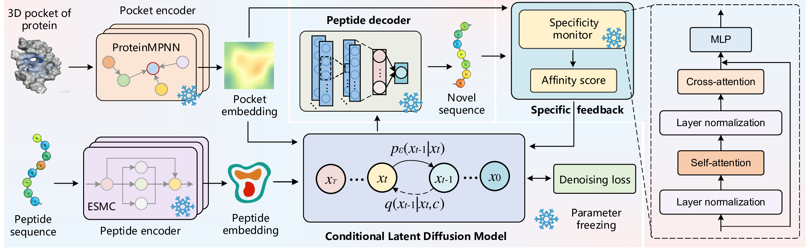

# Pocket-aware Conditional Latent Diffusion Model for Peptide Design

## 1.Environment Setup

For the denoising model, please refer to the dependencies specified in the  [`environment.yml`](environment.yml) file.  
Since ESMC has higher Python version requirements, an additional environment is needed. Please ensure you use a newer Python version (e.g., Python 3.12 or above) to properly obtain sequence embeddings.
