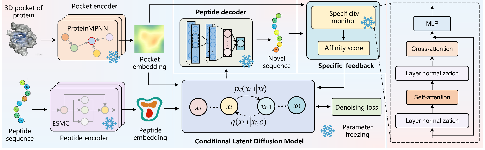

# Pocket-aware Conditional Latent Diffusion Model for Peptide Design
Peptides often exert therapeutic effects on diseases by binding to target proteins.
Diffusion models have emerged as a promising paradigm for peptide design.
However, most methods ignore the structural specificity of target proteins, and cannot monitor affinity during training process, thus limiting their applicability to target-aware peptide design.

Therefore, we propose a target-specific peptide design framework, called **PocketPep**, that harmonizes 3D pocket-aware conditional latent diffusion with specific feedback mechanisms.


## 1.Environment Setup

For the denoising model, please refer to the dependencies specified in the  [environment.yml](./environment.yml) file.  
Since ESMC has higher Python version requirements, an additional environment is needed. Please ensure you use a newer Python version (e.g., Python 3.12 or above) to properly obtain sequence embeddings.

The model weights can be downloaded from [this link](https://drive.google.com/file/d/1SuhqbCUKjTJS0Fp-YkQsx5OGIgJW_PWX/view?usp=drive_link).
Please download them and replace the corresponding directory with the downloaded files.

# 2.Example Workflow
**First**, structural features of the target binding pocket are extracted using `get_pocket.py` from the `ProteinMPNN` module in the `datasets` directory. 

These pocket representations are subsequently used to guide the generation of compatible peptide sequences and to support downstream binding affinity prediction.

You can view the full list of command-line arguments and their descriptions for any Python script by running it with the `--help` flag. For example:

```bash
python get_pocket.py --pdb-path ../../example/pocket.pdb --out-path ../../example/pocket.pkl
```

**Second**, you can generate peptide sequences conditioned on a precomputed pocket structural feature file (`.pkl`). 
You are free to specify the peptide length (recommended range: 5–50 residues) and the number of denoising sampling steps (recommended: 50).For example:
```bash
python sample_generate_seq.py \
  --out-path example/output/peptide.fasta \
  --ckpt-path datasets/PocketPep_ckpt \
  --decoder-path datasets/decoder_Pep/model.pt \
  --pocket-path example/pocket.pkl \
  --length 10 \
  --num-sampling-steps 50
```
This will display the following help message:
```text
usage: sample_generate_seq.py [-h] [--out-path OUT_PATH] [--ckpt-path CKPT_PATH]
                              [--decoder-path DECODER_PATH] [--pocket-path POCKET_PATH]
                              [--length LENGTH] [--num-sampling-steps NUM_SAMPLING_STEPS]

optional arguments:
  -h, --help            show this help message and exit
  --out-path OUT_PATH   Path to the output FASTA file where the extracted protein sequence will be saved.
  --ckpt-path CKPT_PATH
                        Path to the PocketPep model checkpoint file.
  --decoder-path DECODER_PATH
                        Path to the Decoder model checkpoint file.
  --pocket-path POCKET_PATH
                        Path to the PKL file containing the structural features of the peptide-binding pocket.
  --length LENGTH       Length of the peptide sequence to be generated.
  --num-sampling-steps NUM_SAMPLING_STEPS
                        Number of denoising sampling steps used during peptide sequence generation.
```
**Third**, you can compute the binding affinity scores between the **peptide sequences generated in Step 2** and the **pocket structural features extracted in Step 1**. 

These predicted affinity scores can be used for downstream filtering, ranking, or experimental validation of high-potential peptide candidates.For example:
```bash
python sample_predict_aff.py \
  --seq "HFTVWHDYSI" \
  --pocket-path example/pocket.pkl \
  --ckpt-path datasets/aff_monitor/model.pt \
  --out-path example/output/res.csv
```
This will display the following help message:
```text
usage: sample_predict_aff.py [-h] [--out-path OUT_PATH] [--ckpt-path CKPT_PATH] [--seq SEQ] [--pocket-path POCKET_PATH]

optional arguments:
  -h, --help            show this help message and exit
  --out-path OUT_PATH   Path to the output file where the predicted affinity scores will be saved.
  --ckpt-path CKPT_PATH
                        Path to the aff_monitor model checkpoint file.
  --seq SEQ             Peptide sequence used for inferring binding affinity.
  --pocket-path POCKET_PATH
                        Structural representation of the binding pocket used for inferring peptide affinity.
```

## 3.Train
**First**, we train the sequence_decoder model to reconstruct the original sequences from their representations, enabling more effective training of the subsequent diffusion model.
The implementation details can be found in the `decode_train.py` file under the `decoder` directory. 
For example:
```bash
python decode_train.py \
  --num-steps 3001 \
  --batch-size 32 \
  --learning-rate 1e-3 \
  --min-learning-rate 5e-5 \
  --train ../datasets/train.csv \
  --test ../datasets/test.csv \
  --checkpoint-steps 200 \
  --output res_model
```
This will display the following help message:
```text
usage: decode_train.py [-h] [--num-steps N_STEPS] [--batch-size BATCH_SIZE] [--learning-rate LEARNING_RATE] [--min-learning-rate MIN_LEARNING_RATE] [--train TRAIN_CSV_PATH]
                       [--test TEST_CSV_PATH] [--checkpoint-steps CHECKPOINT_STEPS] [--output OUTPUT_PATH]

optional arguments:
  -h, --help            show this help message and exit
  --num-steps N_STEPS   Total number of training steps.
  --batch-size BATCH_SIZE
                        Batch size for training.
  --learning-rate LEARNING_RATE
                        Initial learning rate.
  --min-learning-rate MIN_LEARNING_RATE
                        Minimum learning rate for cosine annealing.
  --train TRAIN_CSV_PATH
                        Path to the training dataset (CSV file).
  --test TEST_CSV_PATH  Path to the testing dataset (CSV file).
  --checkpoint-steps CHECKPOINT_STEPS
                        Number of steps between saving checkpoints.
  --output OUTPUT_PATH  Directory to save trained models and outputs.
```
**Second**, we train a specific monitor using a mixed dataset of receptor and pocket structures. 
By leveraging preprocessed binding affinity data, the model is able to rapidly predict the affinity between peptides and their corresponding pocket/receptor. 
This facilitates the subsequent training of the diffusion model, guiding it with the specific monitor to generate peptide sequences with high binding affinity.
The implementation details can be found in the `monitor_train.py` file under the `affmonitor` directory. 
For example:
```bash
python monitor_train.py \
  --num-steps 40001 \
  --batch-size 64 \
  --learning-rate 5e-5 \
  --receptor ../datasets/receptor_emb \
  --pocket ../datasets/pocket_emb \
  --train ../datasets/monitor_train.csv \
  --test ../datasets/monitor_test.csv \
  --checkpoint-steps 200 \
  --output res_model
```
This will display the following help message:
```text
usage: monitor_train.py [-h] [--num-steps N_STEPS] [--batch-size BATCH_SIZE] [--learning-rate LEARNING_RATE] [--receptor RECEPTOR_PATH] [--pocket POCKET_PATH]
                        [--train TRAIN_CSV_PATH] [--test TEST_CSV_PATH] [--checkpoint-steps CHECKPOINT_STEPS] [--output OUTPUT_PATH]

optional arguments:
  -h, --help            show this help message and exit
  --num-steps N_STEPS   Total number of training steps.
  --batch-size BATCH_SIZE
                        Batch size for training.
  --learning-rate LEARNING_RATE
                        Initial learning rate.
  --receptor RECEPTOR_PATH
                        Path to receptor structure data.
  --pocket POCKET_PATH  Path to pocket structure data.
  --train TRAIN_CSV_PATH
                        Path to the training dataset (CSV file).
  --test TEST_CSV_PATH  Path to the testing dataset (CSV file).
  --checkpoint-steps CHECKPOINT_STEPS
                        Number of steps between saving checkpoints.
  --output OUTPUT_PATH  Directory to save trained models and outputs.
```
**Third**, we train the denoising model under the joint guidance of the specific monitor and the decoder, enabling it not only to perform effective denoising but also to generate peptide representations with high binding affinity.
The implementation details can be found in the `train.py` file under the `PocketPep` directory. 
For example:
```bash
python train.py \
  --results-dir res_model \
  --steps 40001 \
  --ckpt-every 2000 \
  --decoder-path ../../datasets/decoder_Pep/model.pt \
  --monitor-path ../../datasets/aff_monitor/model.pt \
  --pocket-path ../datasets/pocket_emb \
  --emb-path ../datasets/pp_emb \
  --train-csv-path ../datasets/train.csv \
  --batch-size 32
```
This will display the following help message:
```text
usage: train.py [-h] [--results-dir RESULTS_DIR] [--steps STEPS] [--ckpt-every CKPT_EVERY] [--decoder-path DECODER_PATH] [--monitor-path MONITOR_PATH] [--pocket-path POCKET_PATH]
                [--emb-path EMB_PATH] [--train-csv-path TRAIN_CSV_PATH] [--batch-size BATCH_SIZE]

optional arguments:
  -h, --help            show this help message and exit
  --results-dir RESULTS_DIR
                        Directory to save trained models and outputs.
  --steps STEPS         Total number of training steps.
  --ckpt-every CKPT_EVERY
                        Number of steps between saving checkpoints.
  --decoder-path DECODER_PATH
                        Path to the pre-trained decoder model.
  --monitor-path MONITOR_PATH
                        Path to the pre-trained monitor model.
  --pocket-path POCKET_PATH
                        Path to pocket structure data.
  --emb-path EMB_PATH   Path to peptide seqence data.
  --train-csv-path TRAIN_CSV_PATH
                        Path to the training dataset (CSV file).
  --batch-size BATCH_SIZE
                        Batch size for training.
```